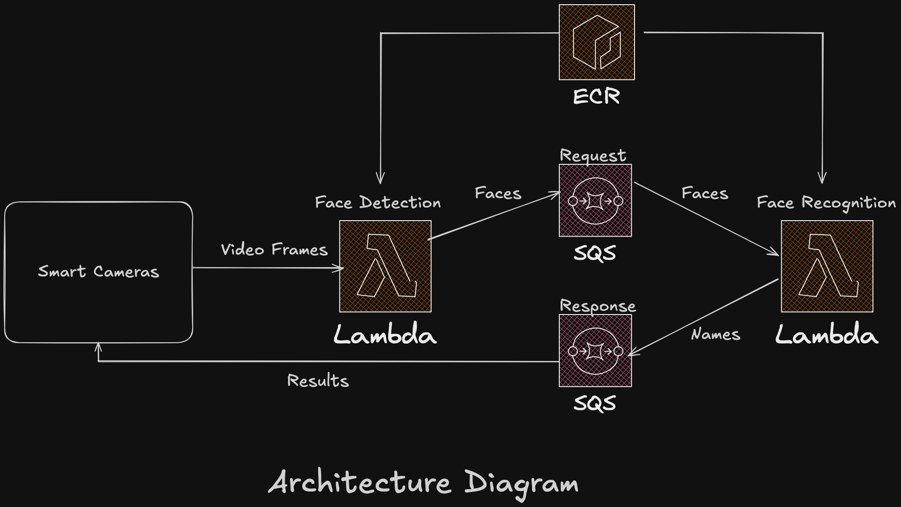

# CSE 546 Project 2 (Part I): PaaS Face Recognition Service

## Summary

This project implements a cloud-based face recognition service using AWS PaaS resources, specifically AWS Lambda, SQS, and ECR. The application processes video frames streamed from clients (simulating IoT devices like security cameras), detects faces, recognizes them, and returns the results.

## Architecture

The application follows a multi-stage pipeline architecture:

1.  **Client:** Sends video frames (as Base64-encoded images) via a POST request to the Face Detection Lambda Function URL. It also polls the SQS Response Queue for results.
2.  **Face Detection Lambda (`face-detection`):**
    - Triggered by the client's POST request via its Function URL.
    - Receives the video frame, request ID, and filename.
    - Uses MTCNN (Multi-task Cascaded Convolutional Networks) via `facenet_pytorch` to detect faces in the frame.
    - Sends each detected face (along with the original request ID) as a message to the SQS Request Queue.
3.  **SQS Request Queue (`<ASU ID>-req-queue`):**
    - Buffers messages containing detected faces from the Face Detection Lambda.
    - Triggers the Face Recognition Lambda.
4.  **Face Recognition Lambda (`face-recognition`):**
    - Triggered by messages arriving in the SQS Request Queue.
    - Uses a pre-trained ResNet model (`InceptionResnetV1(pretrained='vggface2')` via `facenet_pytorch`) to compute embeddings for the detected faces.
    - Compares embeddings against a known dataset (weights file) to identify the person.
    - Sends the recognition result (name/label) and the original request ID as a message to the SQS Response Queue.
5.  **SQS Response Queue (`<ASU ID>-resp-queue`):**
    - Buffers messages containing the final recognition results.
    - Polled by the client to retrieve the outcome associated with its original request ID.

## Technologies Used

- **Cloud Provider:** Amazon Web Services (AWS)
- **Compute:** AWS Lambda
- **Messaging:** AWS Simple Queue Service (SQS)
- **Container Registry:** AWS Elastic Container Registry (ECR)
- **Containerization:** Docker
- **Programming Language:** Python 3
- **Key Python Libraries:**
  - `boto3` (AWS SDK for Python)
  - `facenet_pytorch` (for MTCNN face detection and ResNet face recognition)
  - `Pillow` (Image processing)
  - `opencv-python` (Image processing)
  - `requests` (For client simulation/testing if applicable)
  - `awslambdaric` (Lambda runtime interface client)

## Setup & Configuration

1.  **ECR Repository:**
    - Create an ECR repository.
    - Use the provided `Dockerfile` template to build a container image including all necessary dependencies (Python, `boto3`, `facenet_pytorch`, `Pillow`, `opencv-python`, `requests`, `awslambdaric`). Ensure PyTorch is installed for CPU.
    - Push the built image to your ECR repository.
2.  **SQS Queues:**
    - Create an SQS Standard Queue named `<ASU ID>-req-queue`.
    - Create an SQS Standard Queue named `<ASU ID>-resp-queue`.
3.  **Lambda Functions:**
    - **Face Detection (`face-detection`):**
      - Create a Lambda function using the ECR image.
      - Configure a Function URL for invocation via HTTPS POST requests.
      - Assign an execution role with permissions: `AWSLambdaSQSQueueExecutionRole`, `AWSLambdaVPCAccessExecutionRole`.
      - Set environment variables or configure the handler as needed.
    - **Face Recognition (`face-recognition`):**
      - Create a Lambda function using the _same_ ECR image (override CMD/entrypoint if necessary).
      - Configure an SQS trigger linked to the `<ASU ID>-req-queue`.
      - Assign an execution role with permissions: `AWSLambdaSQSQueueExecutionRole`, `AWSLambdaVPCAccessExecutionRole`.
      - Set environment variables or configure the handler as needed.
4.  **IAM User for Grading:**
    - Create an IAM user named `cse546-AutoGrader`.
    - Attach the required policies: `IAMReadOnlyAccess`, `AmazonSQSFullAccess`, `AWSLambdaSQSQueueExecutionRole`, `AWSLambda_ReadOnlyAccess`.
    - Generate access keys for this user.
